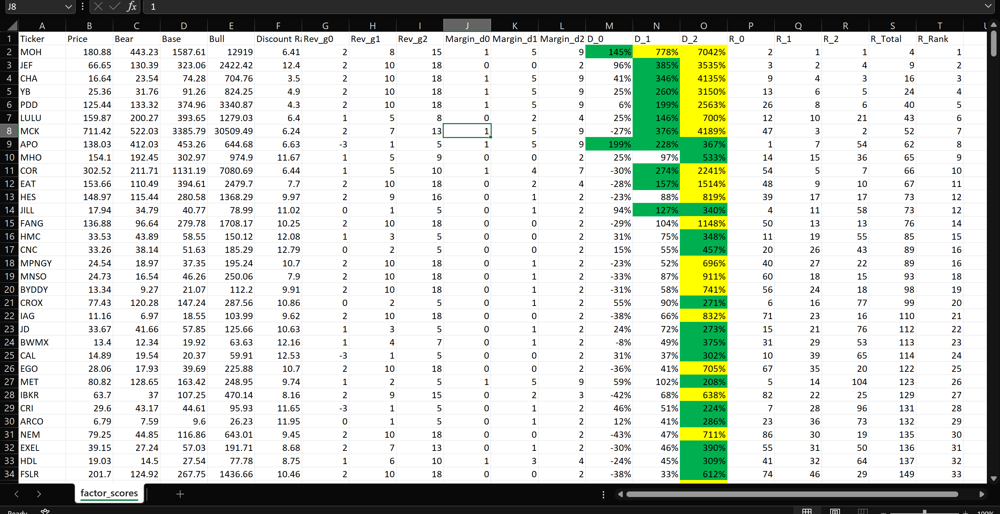
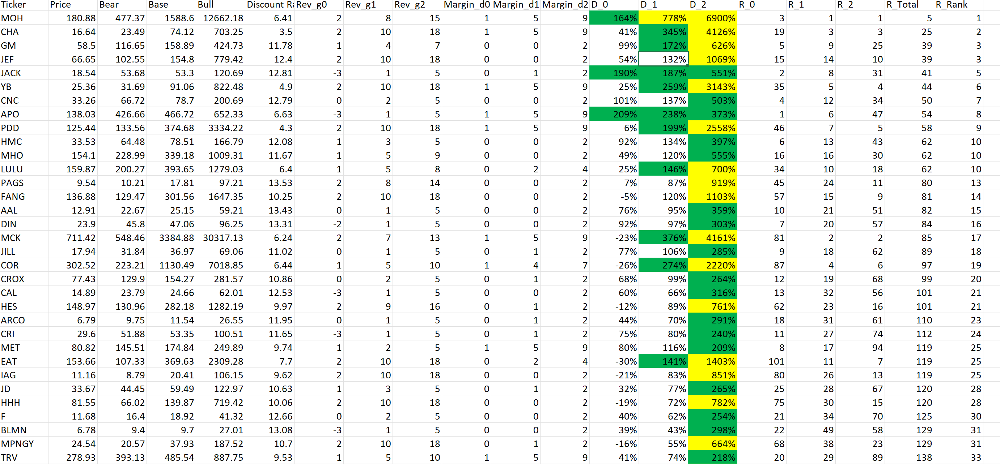

- Price is the live market price at the point in time when the program was last run.  
- Estimates the 'intrinsic' value of a stock via DCF
- Scenario analysis where estimates are based on the degree of conservativeness of various assumptions (growth, discount rate, margin expansion, cap/floor)  

# Output 
Unlevered (preferred)

Levered

